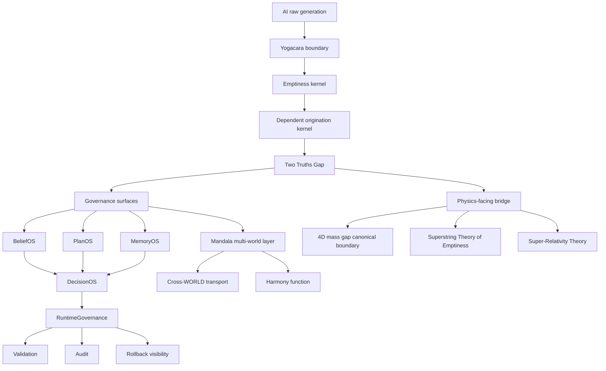

# KuuOS Architecture Diagram v0.1

## Interpretation

This diagram shows the public architectural relation among generation, governance, decision, runtime control, and bridge references.

It does not imply execution authority or theorem authority.
