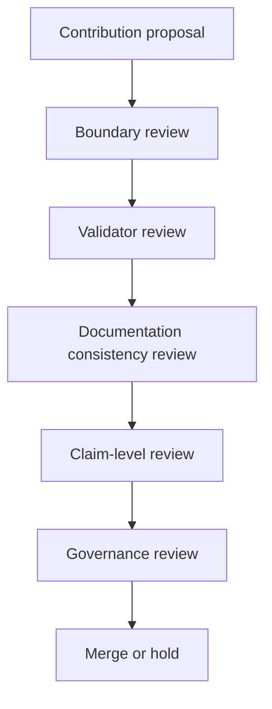

# Contributor Review Workflow v0.1

## Purpose

This document describes the intended review workflow for public KuuOS contributions.

## Contribution Flow

## Step Descriptions

| Step | Purpose |
|---|---|
| Contribution proposal | Initial proposed change |
| Boundary review | Check for authority-boundary violations |
| Validator review | Check validation consistency |
| Documentation consistency review | Check terminology and document coherence |
| Claim-level review | Check claim escalation risks |
| Governance review | Check fail-closed and provenance alignment |
| Merge or hold | Accept, hold, or request revision |

## Important Review Questions

### Boundary Questions

- Does the contribution silently expand authority?
- Does it blur theorem/reference boundaries?
- Does it weaken deployment separation?

### Validation Questions

- Does validator behavior remain explicit?
- Does the change preserve reproducibility?
- Does it weaken existing checks?

### Claim-Level Questions

- Does the contribution escalate structural validation into proof claims?
- Does it blur candidate-versus-authority separation?

### Provenance Questions

- Is lineage preserved?
- Is rollback visibility preserved?
- Is uncertainty visibility preserved?

## Preferred Outcomes

KuuOS prefers:

- explicit review
- explicit boundaries
- explicit uncertainty
- explicit rollback surfaces
- fail-closed behavior

## Legitimate Non-Merge Outcomes

The following are legitimate review outcomes:

- hold
- request clarification
- rollback request
- uncertainty escalation
- abstention from merge

These are not treated as governance failure.

## Interpretation

This workflow describes intended governance review orientation.

It does not grant institutional or deployment authority.
