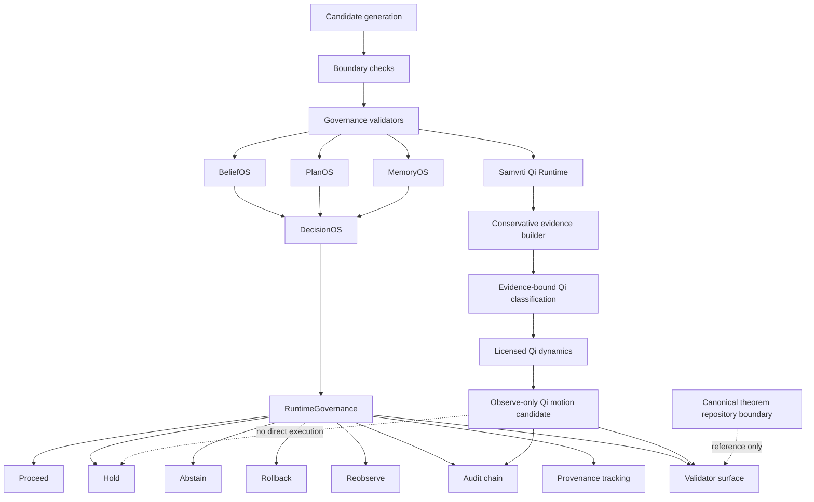

# Governance Diagram v0.1

## Interpretation

This governance flow emphasizes:

- candidate-versus-authority separation
- runtime admissibility
- rollback visibility
- abstention legitimacy
- provenance preservation
- Qi motion candidate non-authority

The Qi motion chain routes bounded motion candidates to validation and audit surfaces. It remains observe-only and does not create clinical, institutional, theorem, or execution authority.

The theorem repository boundary is reference-only unless explicitly elevated by external processes.