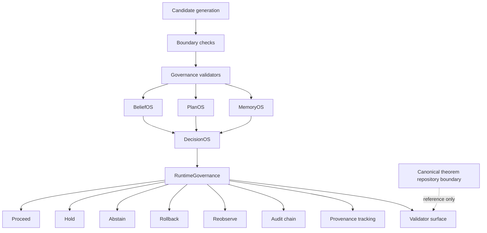

# Governance Diagram v0.1

## Interpretation

This governance flow emphasizes:

- candidate-versus-authority separation
- runtime admissibility
- rollback visibility
- abstention legitimacy
- provenance preservation

The theorem repository boundary is reference-only unless explicitly elevated by external processes.
