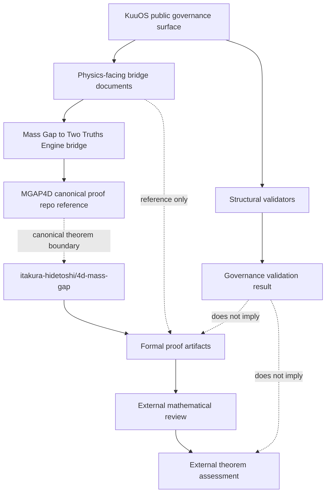

# Theorem Lineage Graph v0.1

## Purpose

This document visualizes the lineage boundaries among KuuOS governance surfaces, physics-facing references, and canonical theorem repositories.

## Interpretation

KuuOS public validation and theorem proof closure are intentionally separated.

KuuOS can reference canonical proof repositories, but does not silently replace them.

## Boundary Rules

- Governance validation is structural.
- Physics-facing bridge documents are reference surfaces.
- Canonical theorem artifacts remain in the canonical theorem repository.
- External mathematical review is an external authority layer.

## Non-Claims

This lineage graph does not claim:

- theorem closure inside KuuOS alone
- institutional approval
- deployment authorization
- clinical authority
