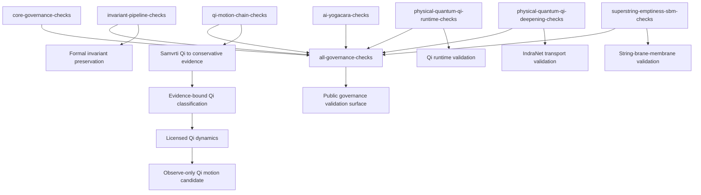

# Validator Graph v0.1

## Interpretation

The aggregate governance surface depends on multiple validator families.

Each edge represents one canonical prerequisite invocation.

Bundle checkers own preparation already encoded by their bundle builders.

Attestation, closure, and finality layers call only their direct prerequisite checker.

Sibling wrappers must not repeat a prerequisite already invoked by the destination checker.

`qi-motion-chain-checks` validates the bridge from Samvrti Qi observation to conservative evidence, evidence-bound classification, licensed dynamics, and observe-only Qi motion candidate output.

Validator success indicates structural consistency of exposed governance surfaces.

Validator success does not automatically imply theorem closure, clinical authority, execution authority, or deployment readiness.
