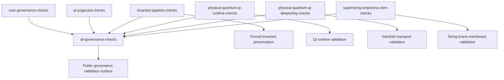

# Validator Graph v0.1

## Interpretation

The aggregate governance surface depends on multiple validator families.

Validator success indicates structural consistency of exposed governance surfaces.

Validator success does not automatically imply theorem closure or deployment readiness.
